# Integración de Sistemas de Comercio Electrónico

## Descripción

Utilizar REST para conectar sistemas basados en HTTP para obtener y generar datos, y devolverlos en formato JSON.

## Estructura del Proyecto

- **`documents`**: Contiene la documentación de la aplicación.
- **`screenshots`**: Contiene capturas de pantalla de la aplicación.
- **`src`**: Contiene el código fuente de la aplicación.
  - **`users`**: Módulo para gestionar usuarios.
  - **`items`**: Módulo para gestionar productos.
  - **`orders`**: Módulo para gestionar pedidos.
- **`app.module`**: Configuración de la base de datos.
- **`tsconfig.json`**: Archivo de configuración de TypeScript.
- **`package.json`**: Archivo que contiene metadatos sobre el proyecto y gestiona las dependencias, scripts y otras configuraciones del proyecto.

## Requisitos
- Node.js
- MySQL
- TypeScript
- NestJS
- TypeORM
- Jest


## Instalación y ejecución

1. Clona el repositorio:
```bash
  git clone https://github.com/alejandrogamezg/rest-api-ecommerce.git
```

2. Navega al directorio del proyecto:
```bash
cd nombre-del-repositorio
```
2. Instalacion:
```bash
npm install
```
3. Inicia el servidor de desarrollo:
```bash
# development
$ npm run start

# watch mode
$ npm run start:dev
```

## Swagger Url

```bash
http://localhost:3000/api/docs#
```

## Pruebas con Postman:

- Consulta GET de todos los usuarios.
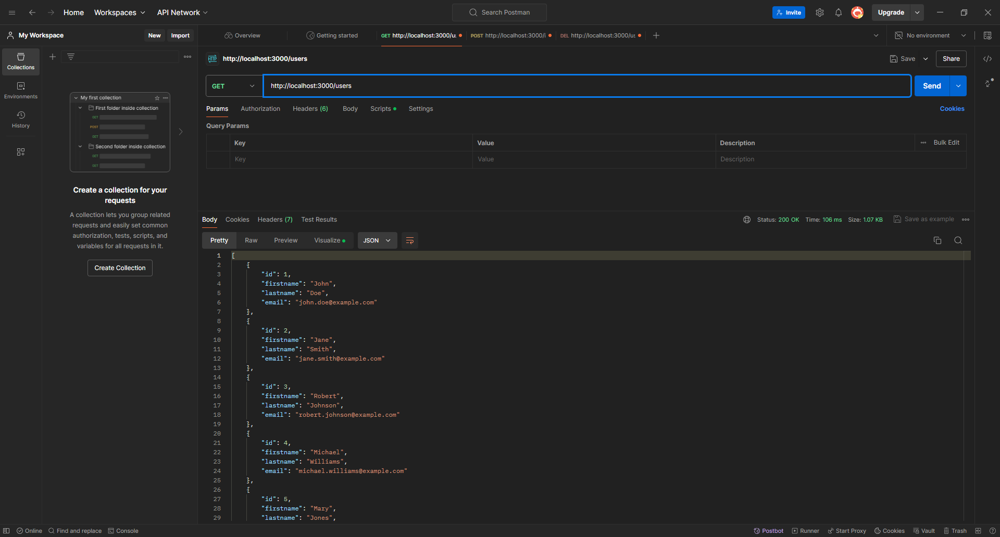

- Consulta GET de todos los items del catálago.
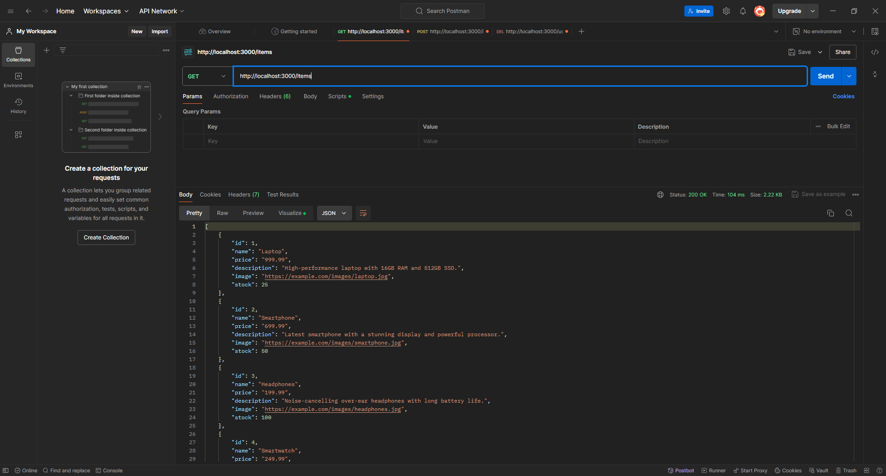

- Consulta GET de una orden creada
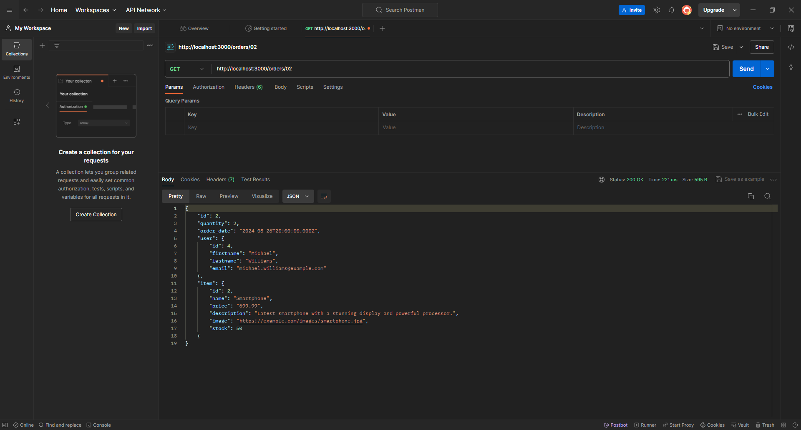
---


## Swagger UI Screenshots

- SWAGGER
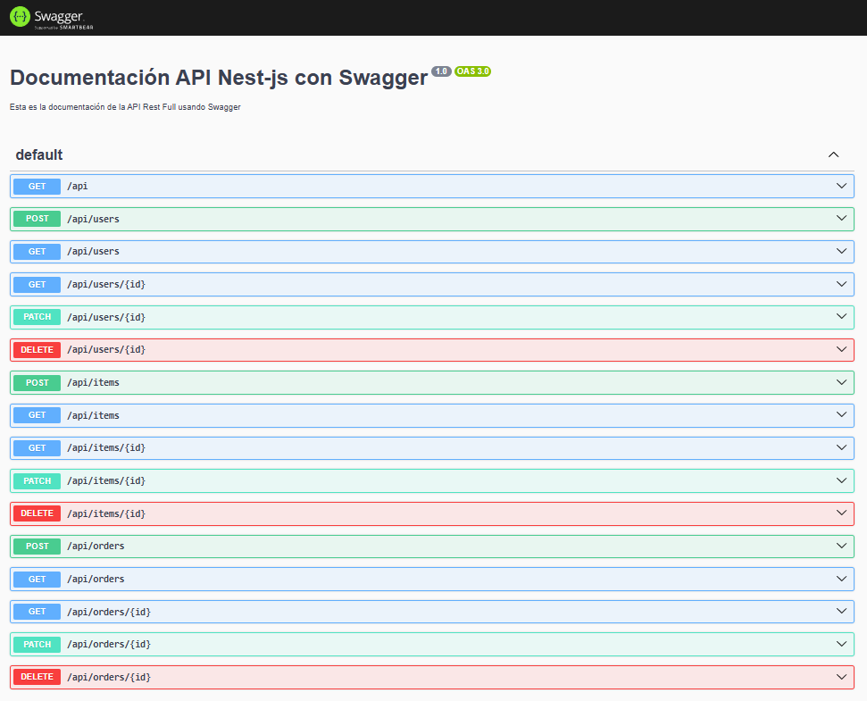

- SCHEMAS
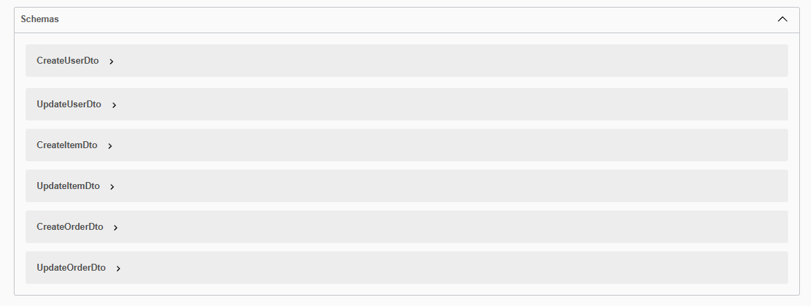

- Consulta GET API
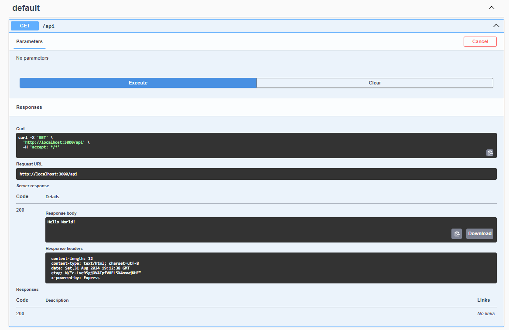

- Consulta POST USERS
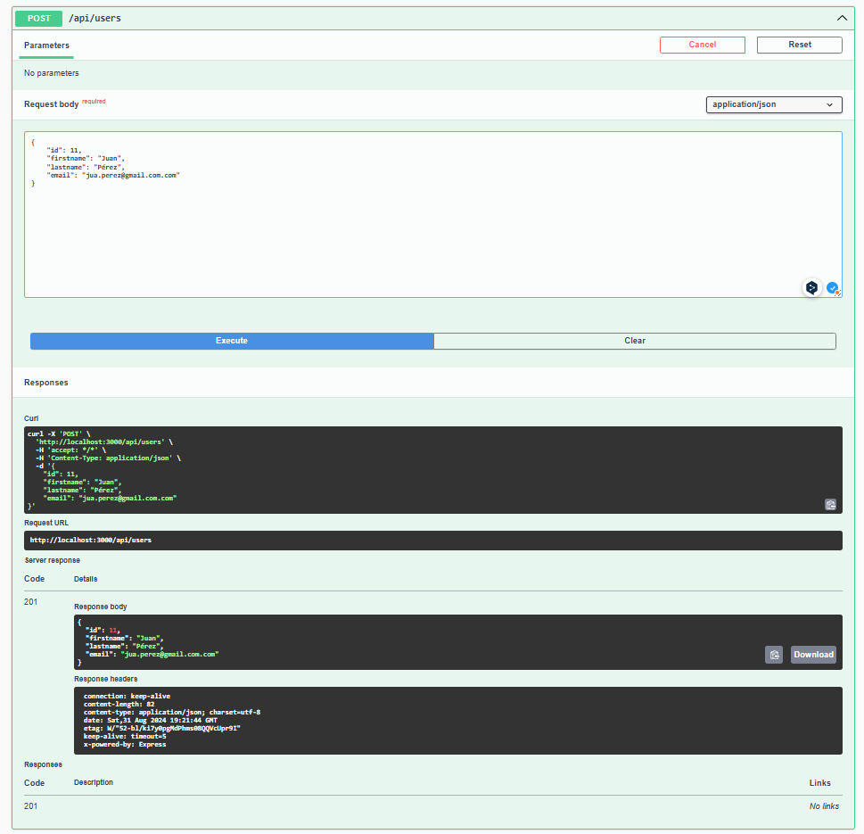

- Consulta GET USERS
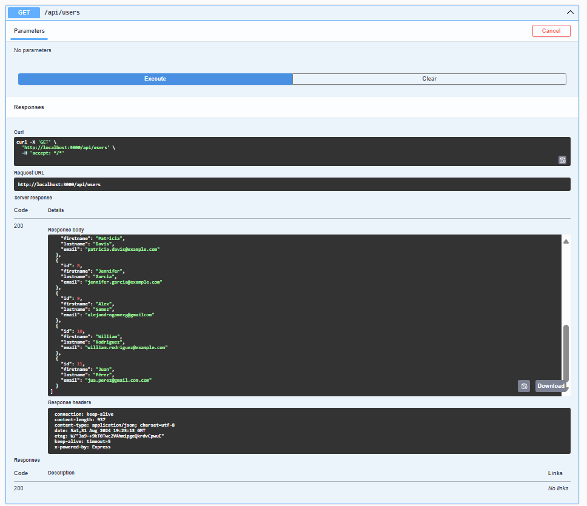

- Consulta GET USERS ID
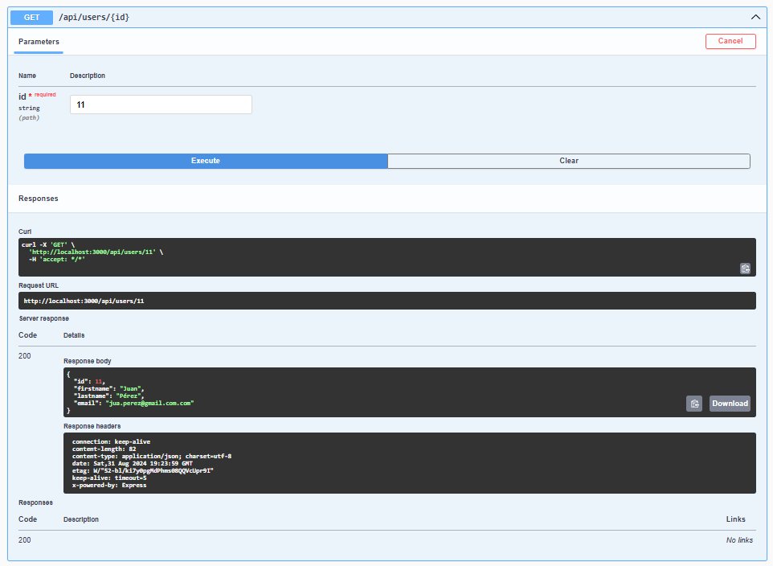

- Consulta PATCH USERS ID
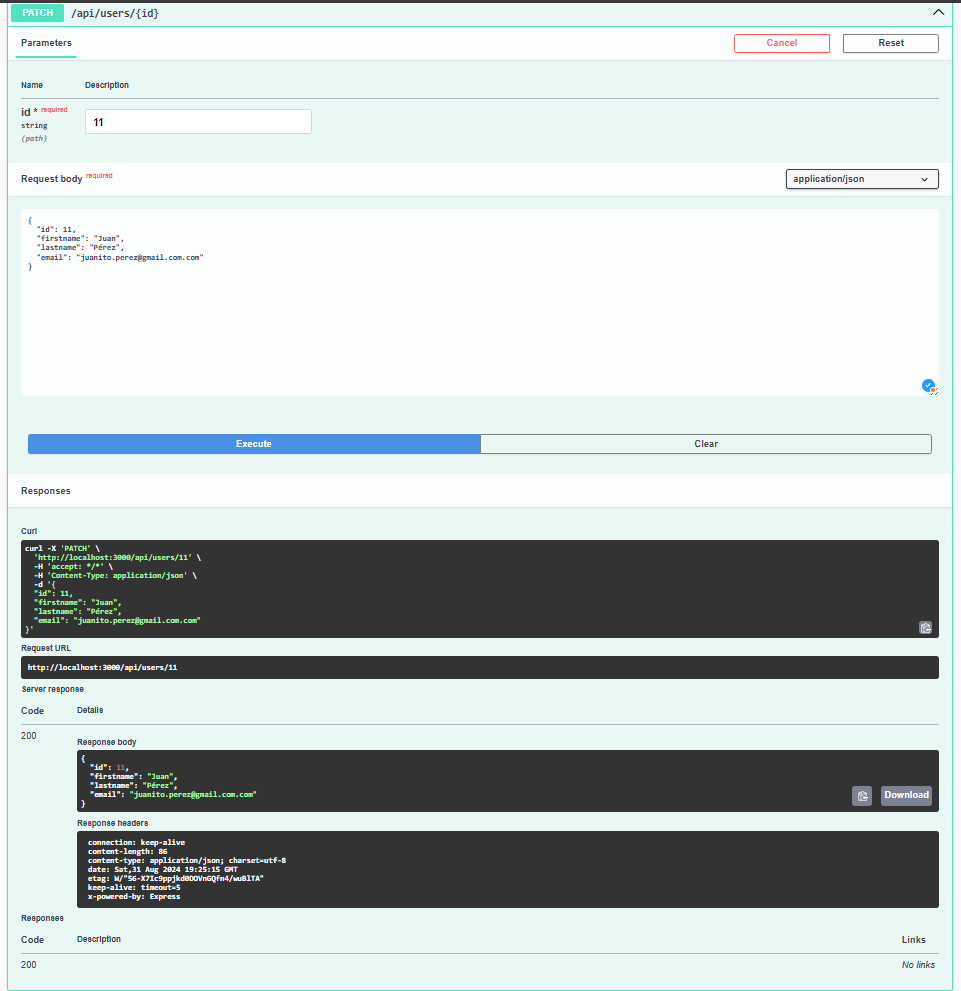

- Consulta DELETE USERS ID
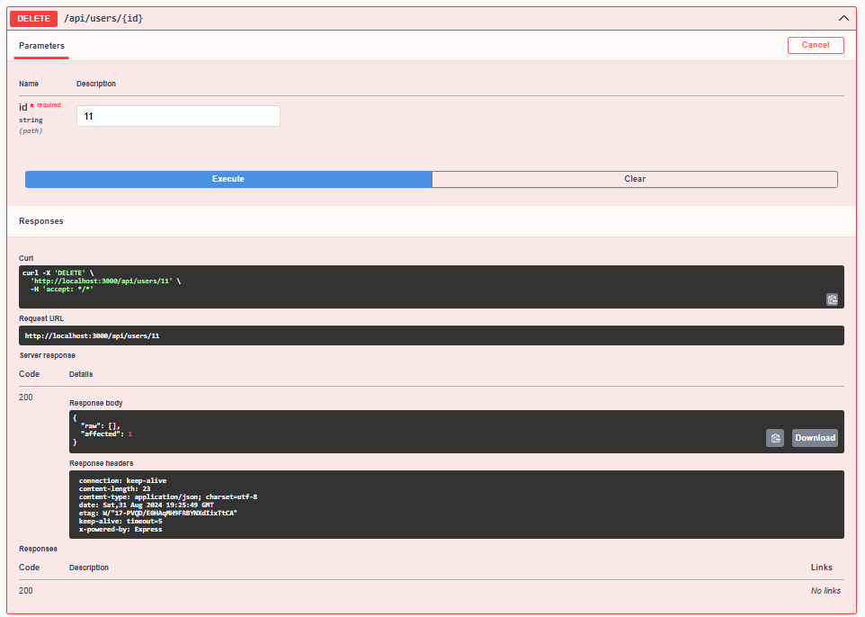
---
## Pruebas Unitarias
1. Instalación:
```bash
npm install --save-dev jest
```
2. Ejecutar pruebas unitarias:
```bash
npm run test
```
- Resultado de las pruebas unitarias usando jest.                                         
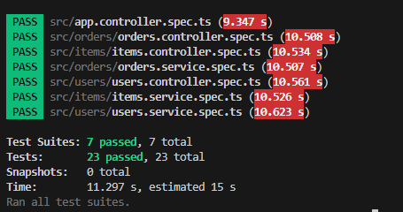

3. Ejecutar pruebas unitarias con informe de coverturta:
```bash
npm run test:cov
```
- Resultado de las pruebas unitarias usando jest.    
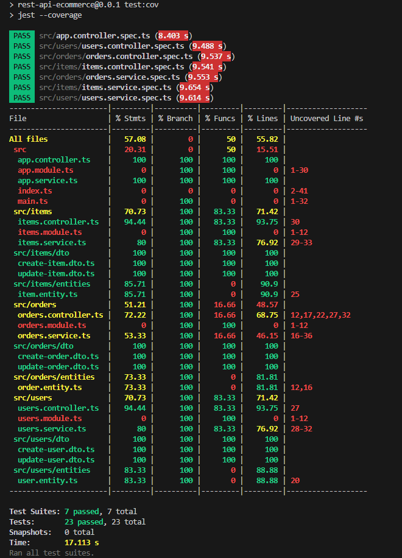
---

## Documentación de Typescript en index.ts:

- Varios tipos de datos diferentes.  


- Enumeraciones para representar diferentes valores.  


- Los tipos any y unknown en diferentes situaciones.  


- Los tipos de unión e intersección en diferentes situaciones.  


- Los tipos de colección en diferentes situaciones.  
  