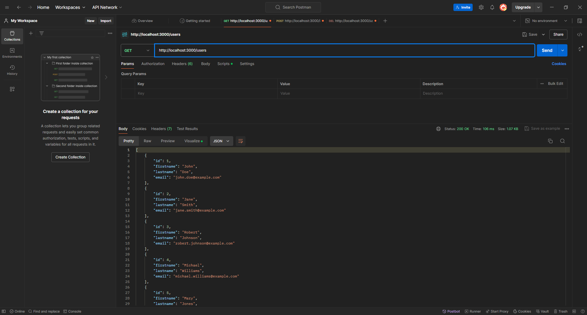
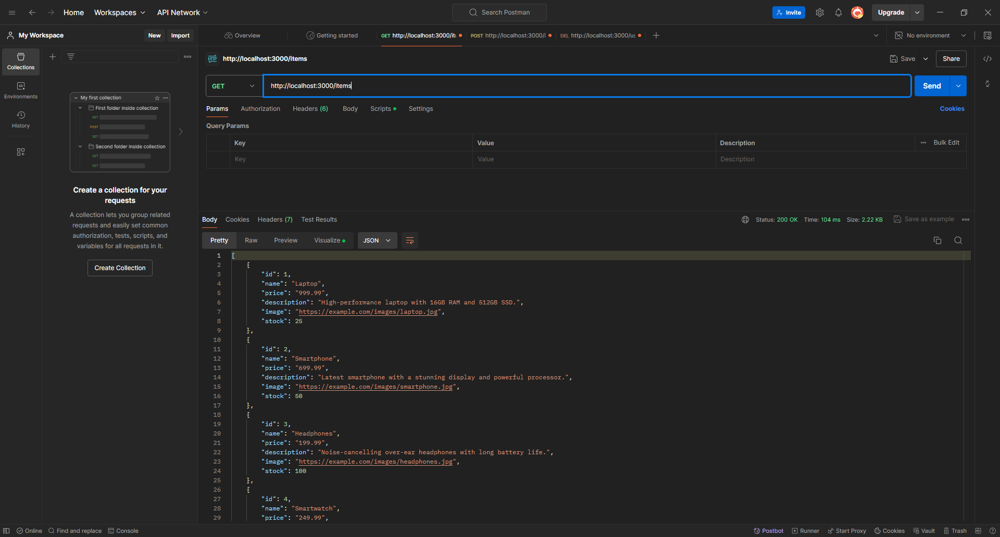
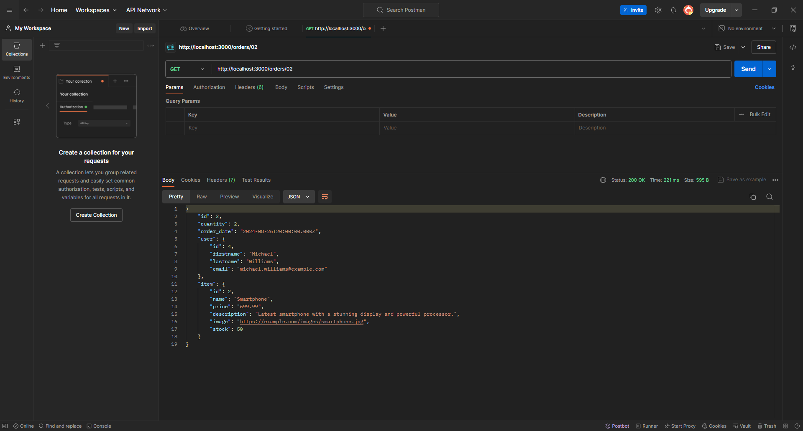

# Integración de Sistemas de Comercio Electrónico

## Descripción

Utilizar REST para conectar sistemas basados en HTTP para obtener y generar datos, y devolverlos en formato JSON.

## Estructura del Proyecto

- **`src`**: Contiene el código fuente de la aplicación.
  - **`users`**: Módulo para gestionar usuarios.
  - **`items`**: Módulo para gestionar productos.
  - **`orders`**: Módulo para gestionar pedidos.
- **`app.module`**: Configuración de la base de datos.

## Requisitos

- Node.js
- MySQL
- TypeScript
- NestJS
- TypeORM


## Instalación y ejecución

1. Clona el repositorio:
```bash
  git clone https://github.com/alejandrogamezg/rest-api-ecommerce.git
```

2. Navega al directorio del proyecto:
```bash
cd nombre-del-repositorio
```

2. Instalar TypeScript de forma global en tu sistema:
```bash
npm install -g typescript
```

3. Inicia el servidor de desarrollo:
Server listen default on `http://localhost:3000/`
```bash
npm run start:dev
```

## Pruebas como Postman:

- Consulta Get de todos los usuarios.


- Consulta Get de todos los items del catálago.


- Consulta Get de una orden creada
