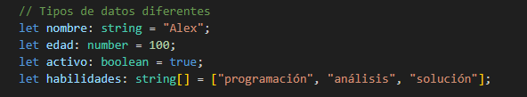
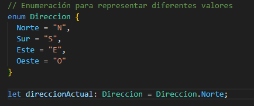
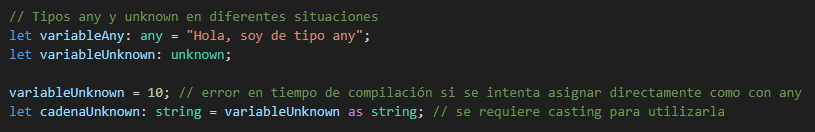
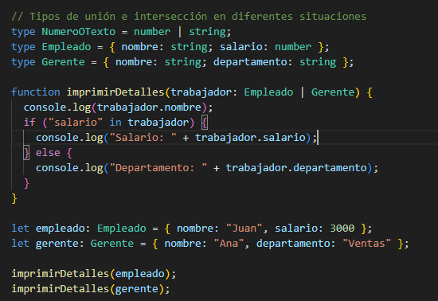
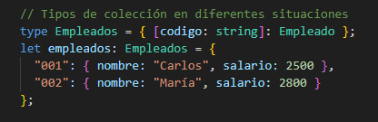

# Integración de Sistemas de Comercio Electrónico

## Descripción

Utilizar REST para conectar sistemas basados en HTTP para obtener y generar datos, y devolverlos en formato JSON.

## Contenido del Repositorio

- **/index.ts**: Archivo de código en TypeScript con diferentes casos.
-**/documents**: Documentación del proyecto.
- **/screenshots**: Carpeta que incluye capturas de pantalla del código y otros aspectos clave del proyecto.
- **README.md**: Archivo que estás leyendo actualmente, que proporciona una descripción general del proyecto.
- **tsconfig.json**: Archivo de configuración de TypeScript.
- **package.json**: Archivo de configuración del proyecto con dependencias y scripts.

## Contenido del script index.ts:

- Varios tipos de datos diferentes.


- Enumeraciones para representar diferentes valores.


- Los tipos any y unknown en diferentes situaciones.


- Los tipos de unión e intersección en diferentes situaciones.


- Los tipos de colección en diferentes situaciones.



## Requisitos

Para ejecutar este proyecto, asegúrate de tener instalado:

- Node.js
- Nest CLI
- TypeScript

## Instalación y ejecución

1. Clona el repositorio:
```bash
  git clone https://github.com/alejandrogamezg/ecommerce-data-sync.git
```

2. Navega al directorio del proyecto:
```bash
cd nombre-del-repositorio/src/
```

2. Instalar TypeScript de forma global en tu sistema:
```bash
npm install -g typescript
```

3. Compilar el archivo TypeScript (.ts) a JavaScript (.js) utilizando el compilador de TypeScript (tsc):
```bash
tsc archivo.ts
```

5. Ejecutar el archivo JavaScript generado usando Node.js:
```bash
node archivo.js
```